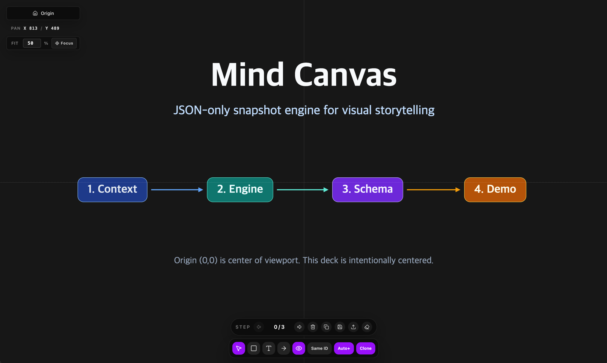

[English](./README.md) | [한국어](./README.ko.md)

# Mind Canvas

Mind Canvas는 아이디어를 발표형 캔버스 장면으로 정리해주는 시각적 스토리텔링 서비스입니다.

기존 슬라이드보다 더 유연하고, 더 흐름감 있게 생각을 전달할 수 있도록 설계되어 있습니다.

## 개요

Mind Canvas는 발표를 끊어진 페이지의 묶음이 아니라, 서로 이어지는 장면의 흐름으로 다룹니다.

그래서 한 장면에서 다음 장면으로 넘어갈 때도 맥락이 유지되고, 청중은 자연스럽게 사고의 흐름을 따라갈 수 있습니다.

특히 다음과 같은 용도에 적합합니다.

- 개념 설명 프레젠테이션
- 스타트업 / 투자자 피치덱
- 기술 아키텍처 워크스루
- 교육용 / 설명형 콘텐츠
- AI 보조 기반 발표 자료 제작

## 주요 기능

- step 단위로 이어지는 스토리 구성
- 텍스트, 블록, 화살표를 활용한 시각적 설명
- 발표 중 흐름을 살려주는 장면 전환
- 저장, 불러오기, 재사용이 쉬운 장면 구조
- AI를 활용한 빠른 발표 초안 생성 흐름

## 왜 유용한가

대부분의 슬라이드 도구는 정적인 페이지에 강합니다.
Mind Canvas는 시각적 연속성과 설명 흐름에 더 강합니다.

즉, 다음이 더 자연스럽습니다.

- 한 번에 모든 정보를 보여주지 않고 단계적으로 드러내기
- 이야기의 흐름을 끊지 않고 개념을 확장해가기
- 복잡한 내용을 더 직관적으로 설명하기
- 아이디어를 빠르게 발표 가능한 형태로 정리하기

## 대표적인 사용 장면

- 창업자가 제품과 시장 이야기를 설명할 때
- 팀이 전략이나 프로세스를 정렬할 때
- 교육자가 개념을 단계적으로 설명할 때
- 디자이너가 사용자 흐름이나 서비스 구조를 보여줄 때
- 기존 슬라이드보다 더 인터랙티브한 전달이 필요할 때

## 사용 경험

Mind Canvas는 다음처럼 단순한 흐름으로 사용할 수 있습니다.

- 시각적 스토리를 만들거나 불러오기
- 캔버스 위에서 내용 배치하기
- step을 이동하며 흐름 점검하기
- 결과를 반복해서 다듬고 재사용하기

이 서비스의 목적은 단순히 오브젝트를 배치하는 것이 아니라,
생각을 더 명확하게 설명할 수 있도록 돕는 것입니다.

## AI 활용 흐름

Mind Canvas는 AI와 함께 쓰기에도 잘 맞습니다.
프롬프트로 장면 초안을 만들고, 바로 불러와서, 시각적으로 수정하고, 다시 발표 자료로 완성할 수 있습니다.

즉, 아이디어에서 발표 가능한 결과물까지 가는 시간을 줄여줍니다.

## 예제

`examples/` 디렉터리에는 다양한 발표 상황을 가정한 샘플이 포함되어 있습니다.

- 스타트업 피치
- 제품 런칭
- 교육용 레슨
- 기술 아키텍처
- 마케팅 캠페인
- 커리어 로드맵
- 장문 morphing 발표 예제
- AI fundamentals 발표 예제

이 예제들은 실제 서비스 사용 장면을 상상해보기에 좋은 출발점입니다.

## 단축키

### 도구

- `Q`: 선택
- `W`: 박스
- `E`: 텍스트
- `R`: 화살표

### 편집

- `Cmd/Ctrl + C`: 선택 복사
- `Cmd/Ctrl + X`: 선택 잘라내기
- `Cmd/Ctrl + D`: 선택 복제
- `Backspace`: 선택 삭제
- `Cmd/Ctrl + Z`: 실행 취소
- `Cmd/Ctrl + Shift + Z`: 다시 실행

### Step / 화면 이동

- `1` 또는 `Left`: 이전 step
- `2` 또는 `Right`: 다음 step
- `Down`: 첫 step으로 이동
- `Up`: 마지막 step으로 이동
- `H`: 이전 step overlay 표시/숨기기
- `P`: 프레젠테이션 모드
- `F`: 선택 노드 포커스
- `C`: viewport 원점 리셋
- `F1`: 단축키 도움말

## 핵심 가치

Mind Canvas는 결국 더 나은 커뮤니케이션을 위한 서비스입니다.

생각을 구조화하고,
설명을 더 명확하게 만들고,
아이디어에서 전달 가능한 이야기로 가는 마찰을 줄이는 것이 핵심입니다.
